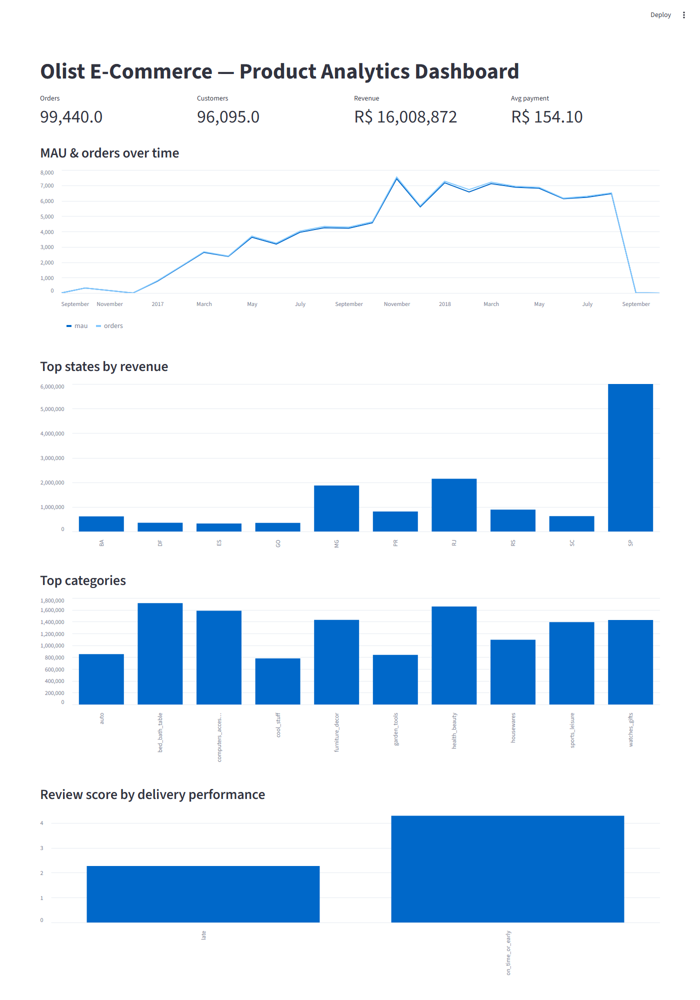
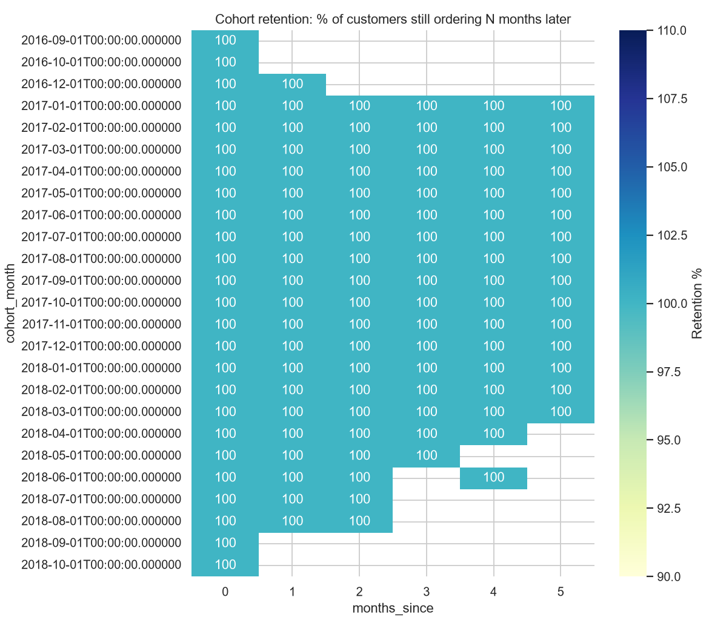

# Olist E-Commerce — Product Analytics Case Study

**One-line problem:** With ~99k real orders and a tiny repeat rate, where is this e-commerce marketplace leaking revenue and customer satisfaction — and what should product fix first?





## Key findings

**Finding 1 — Repeat purchase is extremely rare (not to be confused with monthly churn).**
- Evidence: All-time repeat rate is only **3.1%** (1.03 avg orders/customer, ~96k customers). This is distinct from the *month-over-month* retention metric below.
- Business implication: A repeat-purchase/loyalty program is likely the highest-ROI lever.

**Finding 2 — Month-to-month retention is very low.**
- Evidence: Of customers active in any given month in `sql/04_churn.sql`, typically **≥99%** do not place another order the following month.
- Caveat: This is an e-commerce marketplace, where multi-month gaps between purchases can be normal behavior — interpret relative to peer benchmarks, not as an emergency on its own.

**Finding 3 — Late delivery is strongly associated with lower review scores.**
- Evidence: On-time orders average **4.29/5** vs **2.27/5** for late orders; medians 5 vs 1. Welch t-test: t≈101, p<0.001, n=~96k.
- **Effect size & uncertainty:** mean difference = **2.02 points**, **95% CI [1.98, 2.06]**, **Cohen's d = 1.47** (very large).
- Limitation: observational comparison — late delivery may proxy for problematic regions/categories. It does **not** establish causation.
- Business implication: Prioritize delivery SLAs in hotspot regions; investigate geo/category confounders before attributing fully.

**Finding 4 — Revenue is concentrated geographically and by category.**
- Evidence: São Paulo ≈ R$6.0M of R$16.0M total; top categories (item-grain revenue): bed/bath & table, health/beauty, computers accessories.
- Business implication: Logistics and marketing spend should over-index on SP and the top categories.

## Tools
- SQL (DuckDB) · Python (pandas, scipy, seaborn, matplotlib) · Streamlit

## Methodology
1. Downloaded the public **Olist** dataset (~100k real orders, 2016–2018) into `data/olist.duckdb`.
2. SQL (`sql/`): 8 analyses — order-status funnel, MAU engagement, monthly cohort retention, month-over-month retention, revenue/LTV, state & category segmentation, delivery performance, observational delivery-impact comparison.
3. Python (`scripts/`): quality checks, chart generation, scipy Welch t-test with effect size + 95% CI.
4. **Data grain:** `orders` = one row per order; `order_items` = one row per item; `payments` = one row per payment attempt; `customers` = one row per anonymous customer id. Revenue by category is computed at **item grain** (`price + freight_value`) to avoid join fan-out between orders×payments.

## Run it yourself
```bash
pip install -r requirements.txt
python scripts/build_db.py        # load CSVs into DuckDB
python scripts/quality_checks.py  # 8/8 data-quality checks
python scripts/run_sql.py         # run all SQL analyses -> results/
python scripts/make_charts.py     # charts -> charts/
python scripts/delivery_impact.py # t-test, effect size, CI
streamlit run dashboard/app.py   # interactive dashboard
```

## Repository structure
```
data/      raw CSVs + olist.duckdb (excluded from git)
sql/       01 funnel, 02 active users, 03 cohort retention, 04 month-over-month retention,
           05 revenue/LTV, 06 segments, 07 delivery vs reviews, 08 delivery impact
scripts/   build_db, run_sql, make_charts, delivery_impact, quality_checks
charts/    generated charts + dashboard screenshot
dashboard/ Streamlit app
results/   CSV outputs of each query
```
