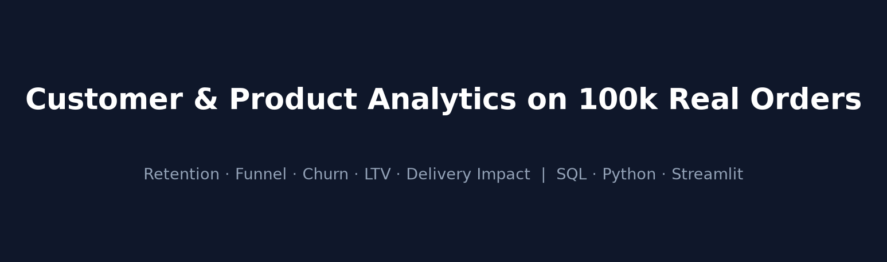
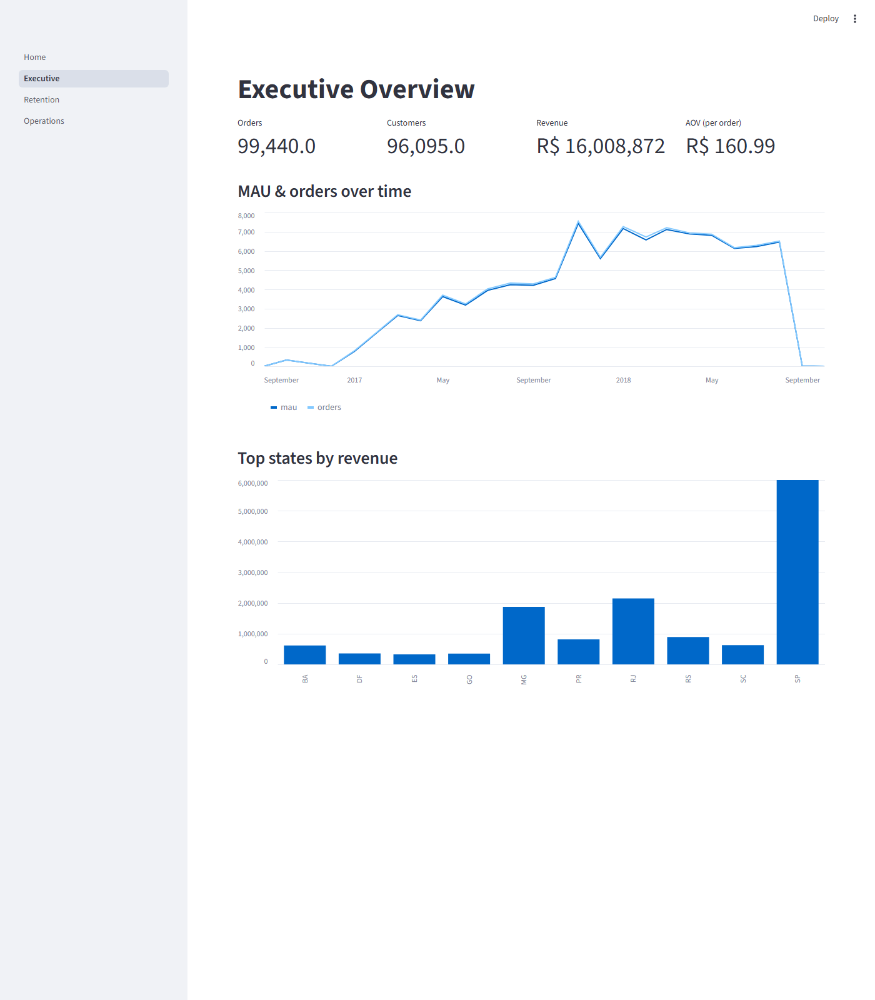
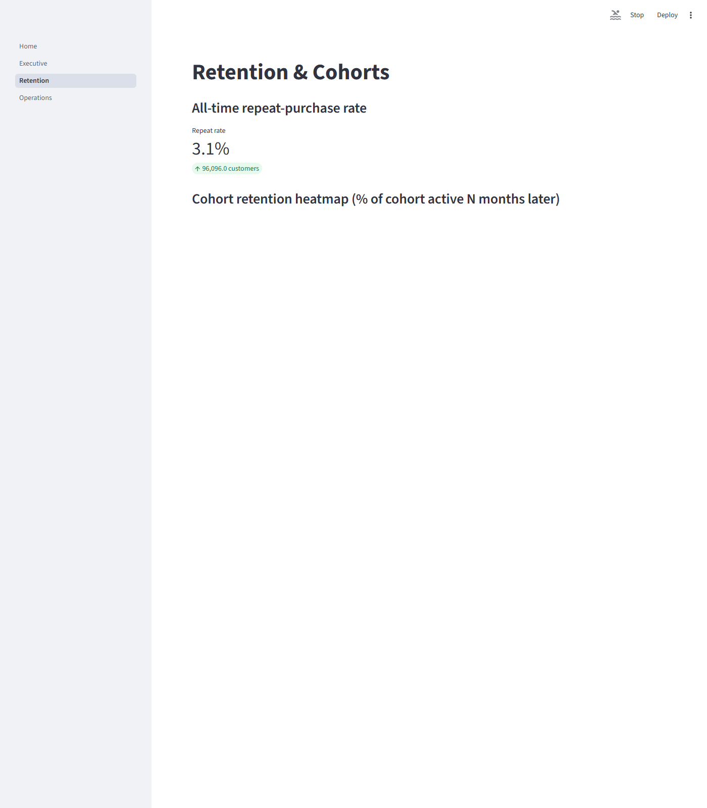
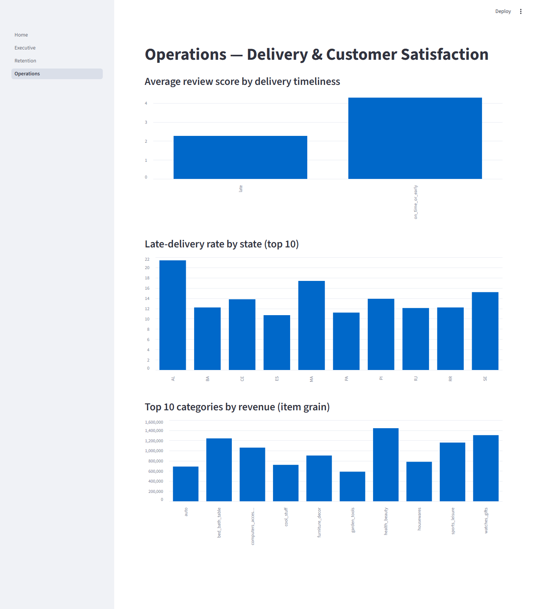
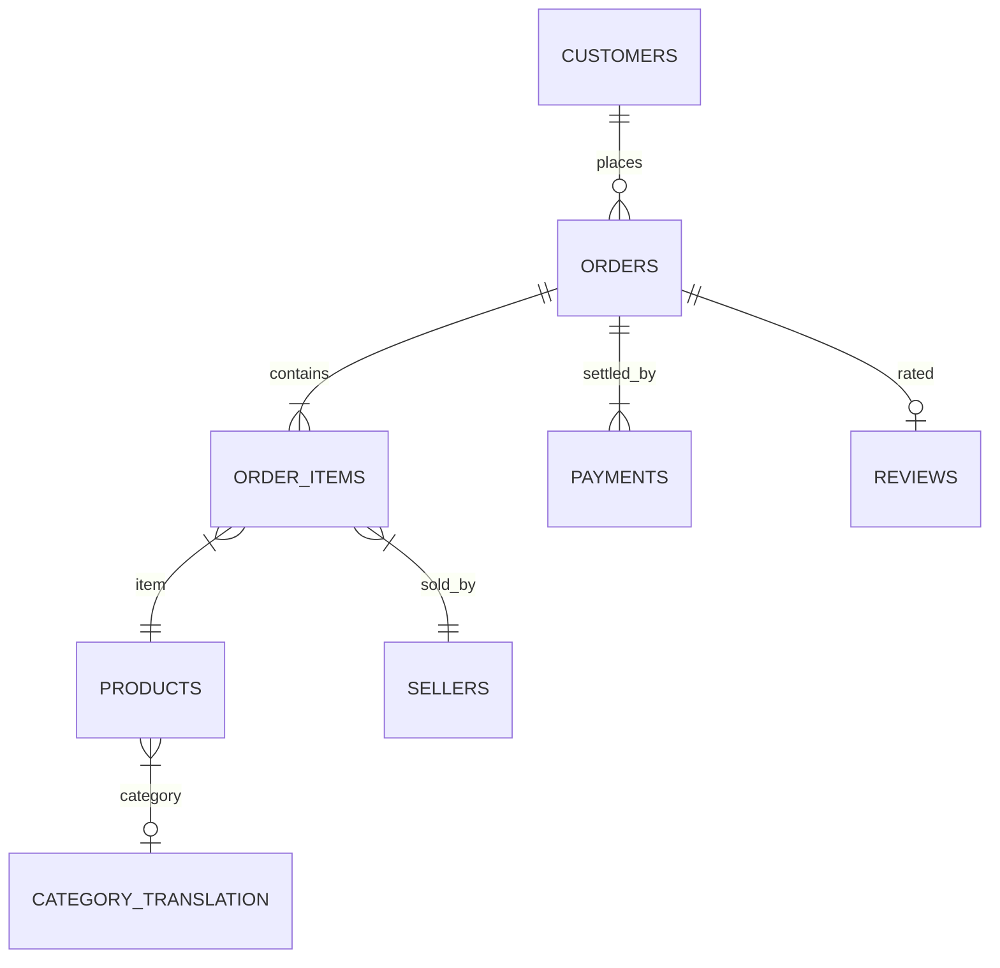

# 📊 Olist — Customer & Product Analytics Case Study



   

> **Customer/Product Analytics** analysis of **~100k real e-commerce orders (2016–2018)** focused on funnel conversion, **retention**, churn, LTV, and delivery impact on satisfaction.

## 🔑 Key findings

1. **🔁 Repeat purchase rate is only ~3.1%** — nearly every customer buys once and never returns. The biggest value lever is a retention program, not acquisition.
2. **📉 Month-over-month retention is very low** — of customers active in any month, typically ≥99% place zero orders the following month (see `sql/04_churn.sql`). Normal for one-off purchases, but it means each cohort decays in one month.
3. **📦 Late delivery strongly associates with bad reviews** — on-time avg 4.29/5 vs late 2.27/5. **Welch t-test t≈101, p<0.001; mean difference 2.02 pts, 95% CI [1.98, 2.06], Cohen's d 1.47 (very large).** Observational, **not causal**.
4. **🗺️ Revenue is concentrated** — São Paulo ≈ R$6.0M of R$16.0M total; top categories: bed/bath, health & beauty, computers accessories.
5. **✅ Insights are reproducible** — 8/8 automated data-quality checks pass; AOV = R$161; total revenue R$16.0M; no join fan-out (item-grain revenue verified within 5% of payments total).

## 🖼️ Dashboard preview

| Executive | Retention | Operations |
|---|---|---|
|  |  |  |

## 🛠️ Tools & stack
| Layer | Tools |
|---|---|
| SQL | DuckDB — 8 analyses (`sql/`) |
| Python | pandas, scipy (stats), seaborn/matplotlib (`scripts/`) |
| Dashboard | Streamlit multi-page (`dashboard/`) |
| Data | Public Olist dataset (~100k orders, 2016–2018) |

## 🧭 Data model



| Table | Grain | Key use |
|---|---|---|
| `orders` | 1 row / order | funnel status, timestamps |
| `order_items` | 1 row / item | item-grain revenue |
| `payments` | 1 row / payment attempt | revenue, payment type |
| `customers` | 1 row / customer | unique-customer metrics |
| `reviews` | 1 row / review | satisfaction proxy |
| `products` / `sellers` | 1 row / product or seller | segmentation |

## 📈 Methodology
1. Download Olist CSVs → `data/` and load to DuckDB (`scripts/build_db.py`).
2. Run automated quality checks (`scripts/quality_checks.py`) → **8/8 pass**.
3. Execute SQL analyses (`scripts/run_sql.py`) → `results/*.csv`.
4. Visualize (`scripts/make_charts.py`) and test delivery-vs-review effect (`scripts/delivery_impact.py`).
5. Serve results interactively: `streamlit run dashboard/Home.py` → Executive / Retention / Operations pages.

## ✅ Measurable recommendations
| Recommendation | Segment/target | Expected impact |
|---|---|---|
| Launch a repeat-purchase loyalty program | All single-purchase customers (~96.9%) | Each +1pt in repeat rate ≈ +~970 orders |
| Reduce late-delivery rate in worst states | Regions with late rate > 10% (Operations page) | Associated +2 review points per on-time order |
| Concentrate logistics spend | São Paulo (38% of revenue) | Protects largest revenue base |
| Prioritize on-time reviews for top categories | bed/bath, health/beauty, computers | Highest-value revenue protected |

## ⚠️ Limitations
- Observational, non-randomized data → delivery/review link is **associational**, not causal.
- Real-world e-commerce purchases are often one-off → low month-over-month retention is not automatically a defect.
- Dataset spans 2016–2018 Brazil only; findings may not generalize.
- Olist has no clickstream (view→cart) events → true top-of-funnel conversion is not measurable here.
- `customers.customer_unique_id` treats a device/identity as one customer; cross-device users are undercounted.

## 🚀 Quick start
```bash
git clone https://github.com/aldeninho/olist-product-analytics.git
cd olist-product-analytics
pip install -r requirements.txt
# download Olist CSVs from github.com/olist/work-at-olist-data into data/
python scripts/build_db.py
python scripts/quality_checks.py
python scripts/run_sql.py
python scripts/make_charts.py
python scripts/delivery_impact.py
streamlit run dashboard/Home.py
```

## 📁 Structure
```
charts/    all generated charts + dashboard screenshots + banner
data/      raw CSVs + olist.duckdb (git-ignored)
dashboard/ Home.py + pages/ (Executive, Retention, Operations)
results/   per-query CSV outputs
scripts/   build_db, run_sql, make_charts, make_banner, delivery_impact, quality_checks
sql/       01 funnel … 08 delivery impact
```
